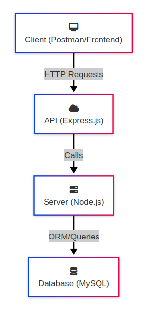
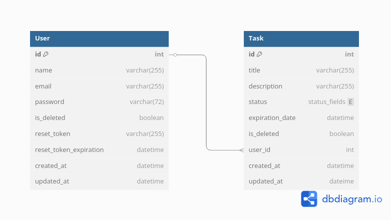
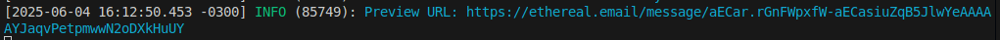
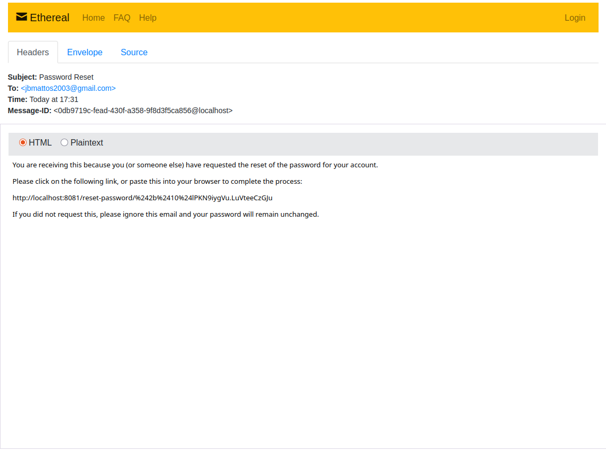

# todo_list
Uma implementação do backend de um app de To-Do List utilizando Node.js e Express.js.

# Sumário
1. [Arquitetura](#arquitetura)
    - 1.1 [Diagrama arquitetural](#diagrama-arquitetural)
    - 1.2 [Diagrama do banco de dados](#diagrama-do-banco-de-dados)
    - 1.3 [Tecnologias utilizadas](#tecnologias-utilizadas)
2. [Como Rodar](#como-rodar)
    - 2.1 [Instalando dependências](#1-instalando-dependências)
    - 2.2 [Variáveis de ambiente](#2-variáveis-de-ambiente)
        - 2.2.1 [Criação manual](#21-criação-manual)
        - 2.2.2 [Rodando env.sh](#22-rodando-envsh)
    - 2.3 [Rodando servidor](#3-rodando-servidor)
3. [Como Testar](#como-testar)
    - 3.1 [Endpoint do Swagger](#endpoint-do-swagger)
    - 3.2 [Coleção do Postman](#coleção-do-postman)
4. [Decisões Técnicas](#decisões-técnicas)
    - 4.1 [Arquitetura](#arquitetura-1)
    - 4.2 [Autenticação e segurança](#autenticação-e-segurança)
    - 4.3 [Logs](#logs)
    - 4.4 [Banco de dados](#banco-de-dados)
5. [Melhorias Futuras](#melhorias-futuras)

# Arquitetura
## Diagrama arquitetural


Você também pode acessar o [link do diagrama](https://www.mermaidchart.com/app/projects/edd1f5eb-4c9e-4fb6-a3b9-a781af77d1af/diagrams/d994d12a-dc80-4573-a5b9-4ab46a11889a/version/v0.1/edit) no Mermaid Chart.

## Diagrama do banco de dados


Você também pode acessar o [link do diagrama](https://dbdiagram.io/d/todo-683e0e0261dc3bf08d36f1a8) no dbdiagram.

## Tecnologias utilizadas
+ Node.js 22.12.0
+ npm 10.9.0
+ Express.js 5.1.0

Escolhi Node/Express com JS puro por uma questão de familiaridade, pois não tenho muito domínio sobre o Typescript ou o NestJS.

# Como Rodar
## 1. Instalando dependências
```bash
npm install
```

## 2. Variáveis de ambiente
### 2.1 Criação manual
Você pode criar um arquivo `env` manualmente, seguindo o arquivo `.env.example` como base.

Para criar sua chave secreta JWT, você pode rodar o script jwt.sh:
```bash
source jwt.sh
```

Se quiser criar manualmente, rode o seguinte comando no seu terminal, depois copie e cole o resultado em `.env`:
```bash
openssl rand -hex 32
```

### 2.2 Rodando env.sh
Esse script automatiza a criação do arquivo `.env`. 

O que o script faz:
1. Cria .env na root do projeto caso não exista
2. Preenche `JWT_SECRET` com o mesmo comando openssl da seção anterior
3. Solicita senha root do MySQL do usuário (importante para os próximos passos)
4. Cria um usuário `todo_user` e o concede privilégios na tabela `todo_list` 
5. Preenche `DB_NAME` com "todo_list"
6. Preenche `DB_USER` com "todo_user"
7. Preenche `DB_PASSWORD` com o comando `openssl rand -base64 16`
8. Preenche `DB_HOST` com "localhost"
9. Preenche `PORT` com 8081
10. Solicita o nível de log do usuário (debug, info, error, etc.)
11. Preenche `LOG_LEVEL` com o nível de log

## 3. Rodando servidor
```bash
npm run dev
```

# Como Testar
## Endpoint do Swagger
Este projeto usa o Swagger para documentação da API. A rota da documentação é `/api-docs`.

## Coleção do Postman
Você pode testar esta API rodando esta [coleção do Postman](https://jb-3144890.postman.co/workspace/JB's-Workspace~92db2518-ee27-4458-8290-11698bc12e4d/collection/45486009-9af3f929-6350-427d-9156-31cb269ae5fb?action=share&creator=45486009).

## Mudança de senha
Este projeto utiliza o Ethereal, um serviço de e-mail falso para ambiente de desenvolvimento, para "enviar" um e-mail requisitando mudança de senha. 

Para acessar o link de mudança de senha, primeiro, envie uma requisição POST para `/request-password-reset` com um email registrado no app.

Então, fique atento para um log com "Preview URL:" no seu terminal, como por exemplo:


Esse link lhe leverá para uma página contendo o conteúdo do e-mail "enviado" pelo Ethereal:


Por fim, copie e cole o link providenciado pelo e-mail no Postman ou em um comando cURL com uma requisição PUT contendo a sua nova senha.

# Decisões Técnicas
## Arquitetura
Escolhi a arquitetura MVCS (Model, View, Controller, Service) para organizar o projeto, pois, dessa forma, é possível separar o código em áreas com responsabilidades bem definidas:
+ Model: Responsável por lidar com a lógica relacionada ao banco de dados, como schema e ORM (usando Sequelize)
+ Controller/View: Responsável por lidar com requisições HTTP, validar e sanitizar o input do usuário, além de sanitizar e retornar a resposta apropriada
+ Service: Responsável pelas regras de negócio e por mediar operações entre Controllers e Models

## Autenticação e segurança
Utilizei JWT para autenticação, atribuindo a lógica responsável por verificar se um usuário está autorizado para acessar uma rota protegida a um middleware de autenticação. Além disso, por uma questão de segurança, implementei hashing das senhas armazenadas no banco de dados.

## Logs
Decidi implementar logging estruturado utilizando Pino neste projeto, porque logs estruturados facilitam o processo de debug e de compreensão do código. 

## Banco de dados
Por uma questão de familiaridade, escolhi o MySQL como o SGBD deste projeto. O design do banco foi muito simples, com apenas duas tabelas com uma relação many-to-one entre User e Task. Além disso, implementei _soft delete_, ao invés de _hard delete_ neste projeto com o propósito de praticar, pois nunca tinha o feito antes.

# Melhorias Futuras
Se tivesse mais tempo, implementaria testes unitários utilizando um framework de testes como o Jest. Além disso, também usaria um middleware como o express-validator para uma validação de input mais robusta.

Por fim, se tivesse mais tempo, aprenderia mais sobre Typescript para poder usá-lo neste projeto, devido à possibilidade de usar tipagem estática para reforçar validações de input de usuário, além de containerizar o projeto com Docker. 